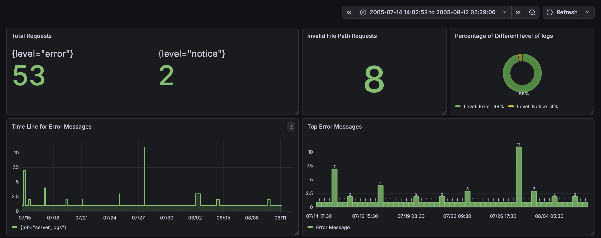
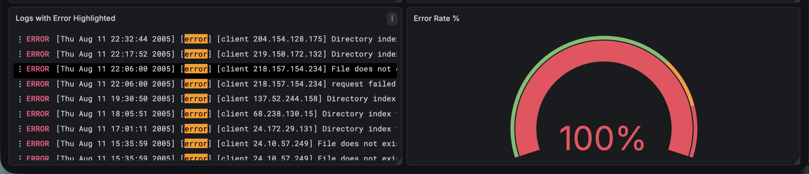

# 📊 Apache Server Log Analysis Dashboard (Grafana+Loki+Promtail)

## 📌 Project Overview:
This project presents a comprehensive Apache Server Log Analytics Dashboard built using Grafana from the Apache Server Log Files.
The Apache Log File is Procured from: https://www.kaggle.com/datasets/omduggineni/loghub-apache-log-data

The goal of this project is to analyze and discover insights from the server log.

---
## 🗂 Dataset Description:

The Dataset is Server Log file. which contains data in following format:
```bash
[Thu Jun 09 06:07:04 2005] [notice] LDAP: Built with OpenLDAP LDAP SDK
```

---
## 📊 Dashboard Screenshots:




---
## 🛠 Tools & Technologies Used:

- Grafana for Visualisations
- Loki as a logging tool.
- Promtail for sending data from log file to Loki


---
## 🚀 How to Use
- Download the Repository.
- Download Docker Desktop.
- ```bash
  docker compose up -d
  ```
- Select Loki as the the Datasource. 
- Create the Dashboard
