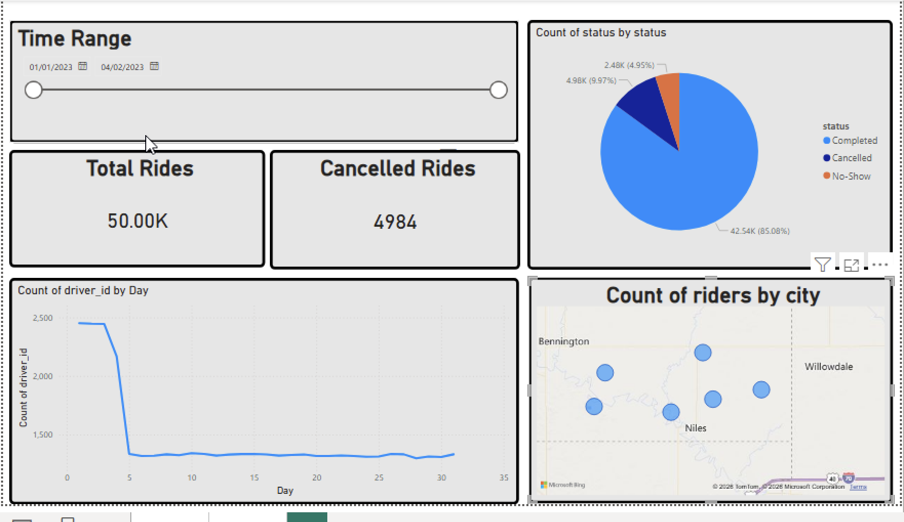
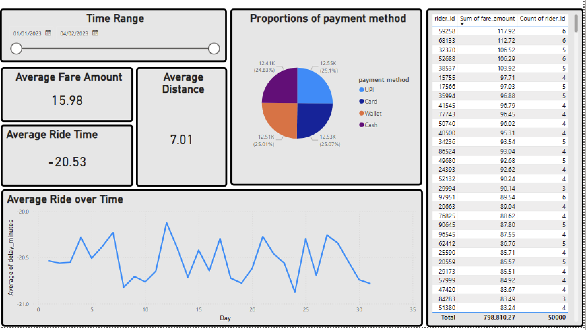

# 📊 Uber Trips Analytics Dashboard (PowerBI)

## 📌 Project Overview:
This project presents a comprehensive Uber Trips Dashboard built using Power BI on the Uber Trips Dataset.

---
## 🗂 Dataset Description:
The project uses the Uber Trips dataset ( https://www.kaggle.com/datasets/rohiteng/uber-trips-dataset ),\
which contains data with the following fields:

- Trip identifiers
- Driver & rider IDs
- City
- Pickup & drop coordinates
- Distance covered
- Fare charged
- Trip status
- Payment method
- Pickup & drop timestamps

---
## 📊 Dashboard Screenshots:




---
## 🛠 Tools & Technologies Used:

- Power BI
- Data Visualization Techniques
- Calculated Fields (Profit Margin, Parsing Dates, etc.)
- Interactive Filters & Controls

---
## 🚀 How to Use
- Clone the repository.
  ```bash
  git clone https://github.com/Nise-r/Analytics-Dashboard.git
  cd Analytics-Dashboard/PowerBi
  ```
- Download and Install Power BI.
- Open the Uber_Dashboard.pbix file and load the .csv file from Data Sources in Power BI.
- And, You will have fully functional dashboard

  
